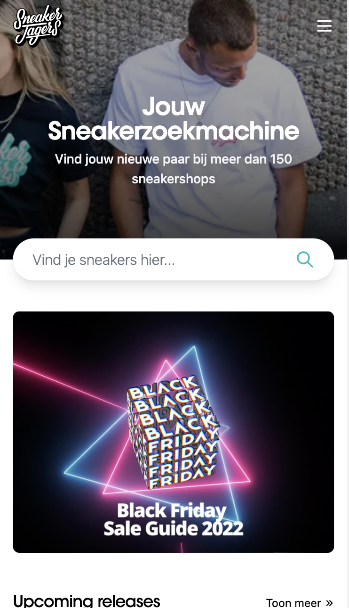

# Procesverslag
Markdown is een simpele manier om HTML te schrijven.  
Markdown cheat cheet: [Hulp bij het schrijven van Markdown](https://github.com/adam-p/markdown-here/wiki/Markdown-Cheatsheet).

Nb. De standaardstructuur en de spartaanse opmaak van de README.md zijn helemaal prima. Het gaat om de inhoud van je procesverslag. Besteedt de tijd voor pracht en praal aan je website.

Nb. Door *open* toe te voegen aan een *details* element kun je deze standaard open zetten. Fijn om dat steeds voor de relevante stuk(ken) te doen.

## Jij

  
uitwerken voor kick-off werkgroep

  ### Auteur:
  Mila de Waard

  #### Je startniveau:
  Blauw

  #### Je focus:
  Surface
 

## Je website

  
uitwerken voor kick-off werkgroep

  ### Je opdracht:
  Voor mijn opdracht ga ik een website verbeteren die op responsive vlak of zoals mijn docent Sanne het zegt: "Bling bling" vlak een extra touch geven. Ik heb gekozen voor de website Sneakerjagers, dit is een website waar je verschillende soorten sneakers kunt vinden en waar de nieuwste sneakers worden gereleased. 
  Maar let op! De website moet voor iedereen toegankelijk zijn en screenreaders moeten belangrijke content kunnen mee lezen.

  <a href= "https://www.sneakerjagers.com">Website Sneakerjagers</a>

  #### Screenshot(s) van de eerste pagina (small screen): 
  Sneakerzoekmachine 
  

  #### Screenshot(s) van de tweede pagina (small screen):
  Releases
  
 

## Toegankelijkheidstest 1/2 (week 1)

  
In de eerste week hebben we de toegankelijkheid van de gekozen website getest. Hoe is het om een beperking te hebben? Kunnen bijvoorbeeld mensen met een motorieke beperking de website gebruiken zonder afhankelijk te zijn van een ander?

  

  ### Bevindingen
  Lijst met je bevindingen die in de test naar voren kwamen:
  

  #### Screenreader
  De Sneakerjagers website heeft veel Engelse termen wat er voor zorgt dat een Nederlandstalige screenreader een aantal Engelse woorden verkeerd uitspreekt.

  Aangezien de website grotendeels uit Engels bestaat zou het niet veel uitmaken als de screenreading in het Engels is in plaats van Nederlands. Het enige probleem dan zou zijn is dat de titel niet goed wordt uitgesproken... en die is vrij belangrijk. 

  #### Muis en Toetsenbord 
  Met de TAB knop ga je van links naar rechts de webpagina door. Het kost een hoop tijd omdat je langs alle koppen, butons en links gaat. Gelukkig is er aan het begin een optie om de toolbar te skippen, maar dat is het dan ook wel.
  Het zou handig zijn als je aan het einde niet langs alle links hoeft, want die zijn niet heel belanrgijk.

  #### Motoriek (shocks, elastiekjes)
  Bij de motoriek oefening kwam ik er achter dat het heel lastig is om op meerdere dingen te gelijk te focussen. Je kunt geen 100% concentratie leggen op het typen of in dit geval op de ballon die ondertussen in de lucht gehouden moest worden. 

  Naast de ballon was er ook een apparaat die je kon laten voelen hoe het kan zijn als je Parkinson hebt. Je kreeg een schok toegediend terwijl je probeerde de website te gebruiken. Wat ik merkte is dat iets langzaams uitvoeren lastiger is dan wanneer je iets snel wilt gaan doen. Bijvoorbeeld met typen, als je langzaam typt duurt het langer voordat je de juiste toets hebt geraakt, omdat de focus dan meer op het trillen van het arm lag dan op het typen. Maar als je sneller probeerde te typen dan maak je wel weer vaker een typefout, en dat kost ook tijd. 
  Een oplossing zou zijn een goede typecursus doen. 

  Dan waren er ook elastiekjes die je om je vinger kon doen. Typen met beperkte vingers voelt heel onwennig aan het begin, maar daar kun je wel aan wennen. Het hangt er natuurlijk wel van af aan welke vinger(s) je een motorieke belemmering hebt.

  #### Visueel (brillen, contrast, kleurenblind, dark/light). 
  Met de verschillende testbrillen werd er steeds een stuk van je zicht afgeschermd. Het vervelende is dat je meer focus moet leggen op hetgeen waar je wel nog zicht op hebt, hierdoor raak je sneller vermoeid in het hoofd of krijg je zelfs hoofdpijn.

  Verder heeft de Sneakerjagers website geen darkmode optie en voor kleurenblinden kan het zijn dat je sneakers koopt met en een bepaalde "kleur" combinatie die jij als kleurenblinden als mooi ervaart, maar voor een ander er daadwerkelijk anders uitzien. 

## Breakdownschets (week 1)

  
Voor het opbouwen van de website Sneakerjagers is het handig om een overzicht te hebben van welke HTML-elementem er gebruikt worden en om na te denken welke onderdelen er voor jou van belang zijn. Hiervoor moesten we aan de hand van een breakdownschets laten zien welke onderdelen weggelaten kan worden en welke HTML-elementen van te pas komen.

  ### de hele pagina: 
  

  ### dynamisch deel (bijv menu): 
  

## Voortgang 1 (week 2)

  
uitwerken voor 1e voortgang

  ### Stand van zaken
  hier dit ging goed & dit was lastig (neem ook screenshots op van delen van je website en code)

  ### Agenda voor meeting
  samen met je groepje opstellen

  | student 1      | student 2          | student 3    | student 4        |
  | ---            | ---                | ---          | ---              |
  | dit bespreken  | en dit             | en ik dit    | en dan ik dat    |
  | en dat ook nog | dit als er tijd is | nog een punt | dit wil ik zeker |
  | ...            | ...                | ...          | ...              |

  ### Verslag van meeting
  hier na afloop snel de uitkomsten van de meeting vastleggen

  - punt 1
  - punt 2
  - nog een punt
  - ...

## Voortgang 2 (week 3)

  
uitwerken voor 2e voortgang

  ### Stand van zaken
  hier dit ging goed & dit was lastig (neem ook screenshots op van delen van je website en code)

  ### Agenda voor meeting
  samen met je groepje opstellen

  | student 1      | student 2          | student 3    | student 4        |
  | ---            | ---                | ---          | ---              |
  | dit bespreken  | en dit             | en ik dit    | en dan ik dat    |
  | en dat ook nog | dit als er tijd is | nog een punt | dit wil ik zeker |
  | ...            | ...                | ...          | ...              |

  ### Verslag van meeting
  hier na afloop snel de uitkomsten van de meeting vastleggen

  - punt 1
  - punt 2
  - nog een punt
- ...

## Toegankelijkheidstest 2/2 (week 4)

  
uitwerken na test in 8e werkgroep

  ### Bevindingen
  Lijst met je bevindingen die in de test naar voren kwamen (geef ook aan wat er verbeterd is):

  #### Screenreader
  Hier korte omschrijving (met indien nodig afbeeldingen)

  Hier een omschrijving van hoe het opgelost kan worden (met indien nodig afbeeldingen)

  #### Muis en Toetsenbord 
  Hier korte omschrijving (met indien nodig afbeeldingen)

  Hier een omschrijving van hoe het opgelost kan worden (met indien nodig afbeeldingen)

  #### Motoriek (shocks, elastiekjes)
  Hier korte omschrijving (met indien nodig afbeeldingen)

  Hier een omschrijving van hoe het opgelost kan worden (met indien nodig afbeeldingen)

  #### Visueel (brillen, contrast, kleurenblind, dark/light). 
  Hier korte omschrijving (met indien nodig afbeeldingen)

  Hier een omschrijving van hoe het opgelost kan worden (met indien nodig afbeeldingen)

## Voortgang 3 (week 4)

  
uitwerken voor 3e voortgang

  ### Stand van zaken
  hier dit ging goed & dit was lastig (neem ook screenshots op van delen van je website en code)

  ### Agenda voor meeting
  samen met je groepje opstellen

  | student 1      | student 2          | student 3    | student 4        |
  | ---            | ---                | ---          | ---              |
  | dit bespreken  | en dit             | en ik dit    | en dan ik dat    |
  | en dat ook nog | dit als er tijd is | nog een punt | dit wil ik zeker |
  | ...            | ...                | ...          | ...              |

  ### Verslag van meeting
  hier na afloop snel de uitkomsten van de meeting vastleggen

  - punt 1
  - punt 2
  - nog een punt
  - ...

## Eindgesprek (week 5)

  
uitwerken voor eindgesprek

  ### Je uitkomst - karakteristiek screenshots:
  

  ### Dit ging goed/Heb ik geleerd: 
  Korte omschrijving met plaatjes

  

  ### Dit was lastig/Is niet gelukt:
  Korte omschrijving met plaatjes

  

## Bronnenlijst

  
continu bijhouden terwijl je werkt

  Nb. Wees specifiek ('css-tricks' als bron is bijv. niet specifiek genoeg).

  1. bron 1
  2. bron 2
  3. ...

